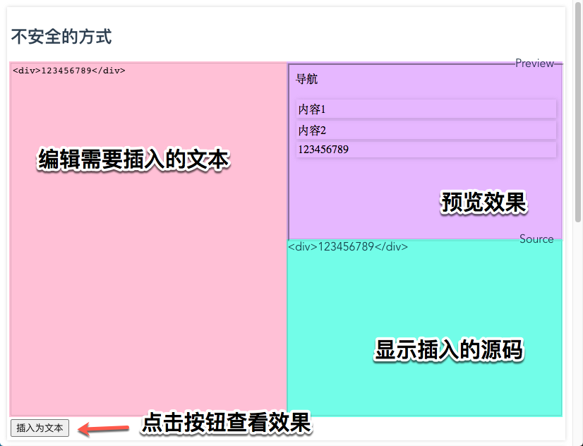

# 演示 DOM 型的 XSS 漏洞

预览 https://xyshaokang.github.io/dom-xss-demo/

用来演示文章 [前端安全: DOM-XSS 漏洞](https://juejin.cn/post/7027884930663186462/) 中的例子

整个页面分为上下两大区域,上面是使用不安全的方式插入文本,下面使用安全的方式插入文本.每个区域可以在左边输入文本,点击插入之后,在右边查看效果和源码.

不安全的部分部分直接使用 innerHTML 插入文本,安全区域会先替换 `<>` 为字符实体之后在插入文本,插入 DOM 操作则使用 DOMPurify 来清洗文本.
